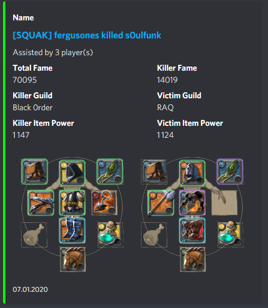
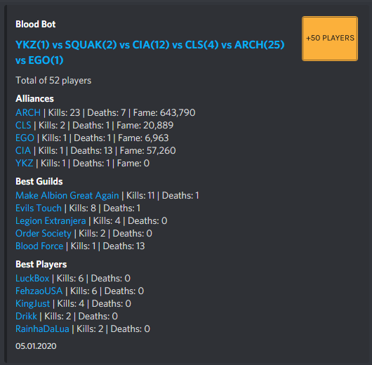

# Bloodbot

One of my old projects from 2019 when I was playing MMORPG Albion Online. Used mainly but my guild and alliance. It was a bot that would send notifications to a discord server when a guild member killed someone, died, or participated in a fight. (with generated images of gear and statistics) The application used a public API that was undocumented. I found out how to use it with debug tools from chrome and watched what requests the page was sending.

The principle of the application was simple, one instance of the **blood-bot-webhook** bot, checked at regular intervals changes in the REST API, in the event of detecting new events, sent to publishers using RabbitMQ, which had the role of a load balancer in this project . A few instances of publishers were there to avoid webhook limits on discord. I provide the code, because it may be useful to someone, because I am not currently developing it myself.

The bot was configured by commands on discord, it was possible to translate it to any language, just add the appropriate file in the translations folder, which will be automatically generated by the bot, along with the default English translation and config during the first download. In it, you will need to complete things like API Key Discord. The repository also includes the bot's translation into Polish.

### Topics covered in the project

  - REST API
  - Message queue (RabbitMQ)
  - Discord API
  - Webhook
  - I19n
  - Web Crawling
  - Image Generation
  - Log rotation

## Screenshots

- **Setting up** - the setup was quite simple intuitive, you can watch the kills by player name, guild or alliance. Then through reactions you can control the rest of the process and only display deaths, kills and from a certain fame level.

- **Kill** - message with the player's inventory, green in color.

- **Death** - message with the player's inventory, green in red.

- **Battle** - messgae with battle and links to the participating guilds and alliances. It had a picture in the corner with the number of players that was visible, with various programs.  
-- **4+ player with light green color**
-- **10+ player with green color**
-- **20+ player with yellow**
-- **50+ player with orange**
-- **100+ player with red**

- **Commands** - list of avaliable commands

